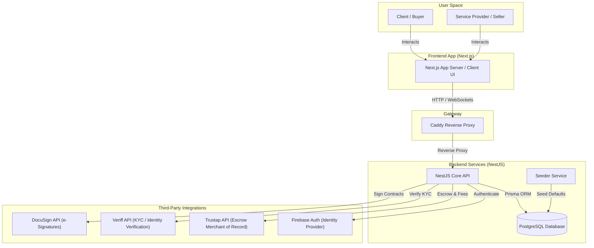
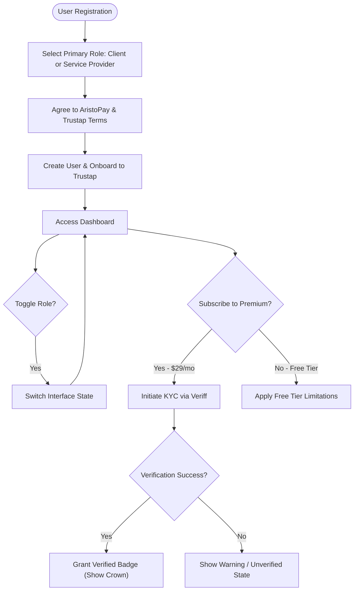
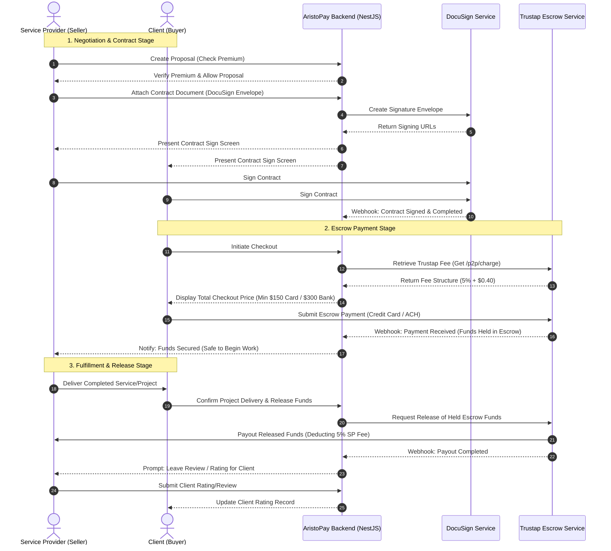
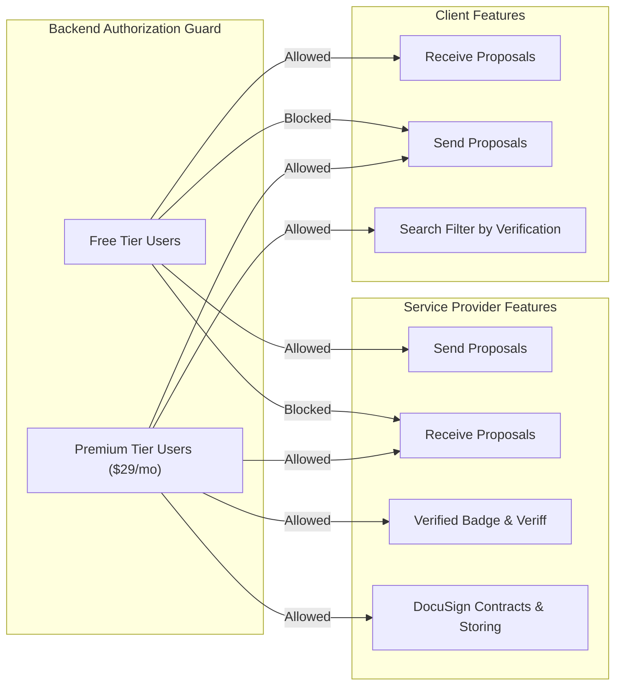

# AristoPay System Architecture & Workflow Diagrams

This document visualizes the system architecture, component relationships, and user transaction lifecycles for the AristoPay platform.

---

## 1. High-Level System Architecture

The following block diagram illustrates the component architecture of AristoPay, including the frontend, API gateway, backend server, database, and external third-party integrations (Trustap, Veriff, DocuSign, Firebase).

---

## 2. User Onboarding & Role Management Flow

Users sign up once and can freely toggle between Client and Service Provider roles. Verification is offloaded to Veriff for premium users.

---

## 3. End-to-End Escrow Transaction & Contract Lifecycle

This sequence diagram details the transactional steps from contract initialization (DocuSign) to payment holding (Trustap Escrow), delivery, fund release, and feedback submission.

---

## 4. Feature Gating Rules Summary

The backend enforces strict access policies based on the user's subscription state:

